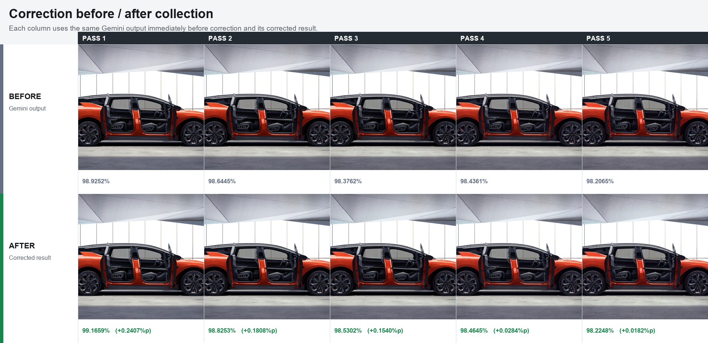

# Gemini Image Fidelity Correction

[Korean](README.md) | [English](README.en.md)

A reference-free image correction model developed to reduce accumulated color and image-quality drift that can appear during repeated generative image editing.

## Background

[Google DeepMind describes SynthID as being invisible to humans and designed not to change image quality.](https://deepmind.google/models/synthid/) In practical production workflows, however, repeatedly feeding the same image into Gemini and overwriting the result again can still show subtle RGB bias, saturation shift, reduced sharpness, and high-frequency texture loss as passes accumulate, even for `no-change` requests.

This project started from the observation that small residual artifacts left by repeated passes through Google's image generation pipeline, including SynthID-enabled outputs, can accumulate during iterative work. The model decomposes the difference between the source and output of each pass into RGB channels, spatial patterns, diagonal phase, and frequency components, then estimates an inverse residual so that an opposing correction can be applied before the next edit.

The training and evaluation data was generated with the Gemini 3.1 Flash Image API model, `gemini-3.1-flash-image`, and includes all four combinations of `1:1` and `16:9` aspect ratios at `1K` and `2K`. During training, source/output pairs are used. During real inference, the model predicts RGB, texture, and frequency correction fields from only the current generated image, without access to the original source.

> Research prototype. This repository is an image-fidelity experiment, not a forensic detector or a guaranteed inverse of a generative model.

## Architecture

- Color-adaptive linear RGB/DC correction
- MLP using RGB, brightness, saturation, local texture, and multi-frequency features
- Residual CNN using axial/diagonal phase channels and dilated convolutions
- Reference-free gate that blends the three correction components using only input-image features
- Channel soft-knee gamut mapping to reduce highlight and shadow clipping

Frequency features use sine/cosine pairs along the `x`, `y`, `x+y`, and `x-y` directions, with periods of 2.67, 4, 8, 16, 32, 64, 128, and 256 pixels. There is no separate solid-color or real-photo routing. The same model is applied to every input.

## Installation

Python 3.11 and a CUDA environment are recommended. Install a PyTorch build that matches your system CUDA version first, then install the remaining dependencies.

```bash
pip install -r requirements.txt
```

## Usage

```bash
python src/apply_advanced_multiband_correction_model.py input.png output.png
```

To use a different weights directory:

```bash
python src/apply_advanced_multiband_correction_model.py input.png output.png \
  --model-dir /path/to/models
```

The output log records the device, reference-free linear strength, hybrid weights, per-channel mean correction amount, and gamut-limit ratio as JSON.

## Evaluation

MAE similarity is calculated as `100 * (1 - mean(abs(candidate - reference)) / 255)`.

| Evaluation | Samples | Mean improvement | Improved / degraded | Worst value |
|---|---:|---:|---:|---:|
| Combined full evaluation | 352 | +0.4613%p | 334 / 18 | -0.7590%p |

The model improves results on average, but it does not improve every image. In evaluation environments where the source is available, compare metrics before and after applying correction.

### Five-pass recurrence on a 1024 real-photo image

`G1 = Gemini(source)` was generated only once, then the following two chains were branched from the exact same `G1`.

1. Uncorrected: `G1 -> G2 -> G3 -> G4 -> G5`
2. Corrected every pass: `G1 -> C1 -> G2' -> C2 -> G3' -> C3 -> G4' -> C4 -> G5' -> C5`

Here, `C1 = correction(G1)`, and later `Cn = correction(Gn')`. Each corrected `Cn` was used as the input for the next Gemini call.

The final MAE similarity was `96.4261%` for the uncorrected chain and `98.2248%` for the corrected-every-pass chain, a gain of `+1.7986%p`. When comparing only immediately before and after each correction step, all five passes were positive, with an average gain of `+0.1244%p`. The step-by-step difference between the two chains also includes Gemini sampling and input-branching effects, so it should not be interpreted as the isolated causal effect of the correction model alone.


### Per-pass before/after correction sheet

Each pass places the Gemini output and the immediately corrected result in the same column. The sheet below shows the overall progression. Original-resolution files are available in the [1024x1024 individual file folder](experiments/recurrence_5x/before_after_1024/).



### Pass 5 zoom comparison

The same 220x220 region marked with a blue box was enlarged 3x to compare the lower door, side sill, and floor texture in the source image, uncorrected Pass 5, and corrected Pass 5.


1024x1024 source comparison files:

- [Source](experiments/recurrence_5x/pass5_comparison_1024/01_original_1024.png)
- [Uncorrected Pass 5](experiments/recurrence_5x/pass5_comparison_1024/02_pass5_uncorrected_1024.png)
- [Corrected Pass 5](experiments/recurrence_5x/pass5_comparison_1024/03_pass5_corrected_1024.png)

## Pattern Visualization

The visualization images remove channel DC and apply automatic gain for display. The visible intensity in these images is not the same as the actual correction magnitude.


## Files

- `src/`: inference and experiment code
- `models/`: four weights required for release inference
- `experiments/evaluation/`: grouped 5-fold and external holdout summaries
- `experiments/recurrence_5x/`: five-pass recurrence comparison for a 1024 real-photo image
- `docs/`: component/FFT pattern visualizations

## Limitations

- Correction can degrade images outside the training distribution.
- Strong generative changes, geometric changes, and reframing cannot be restored.
- Repeated generation experiments are affected by the stochasticity of Gemini outputs.
- CPU inference is possible, but it is much slower than CUDA at 1024 and above.
