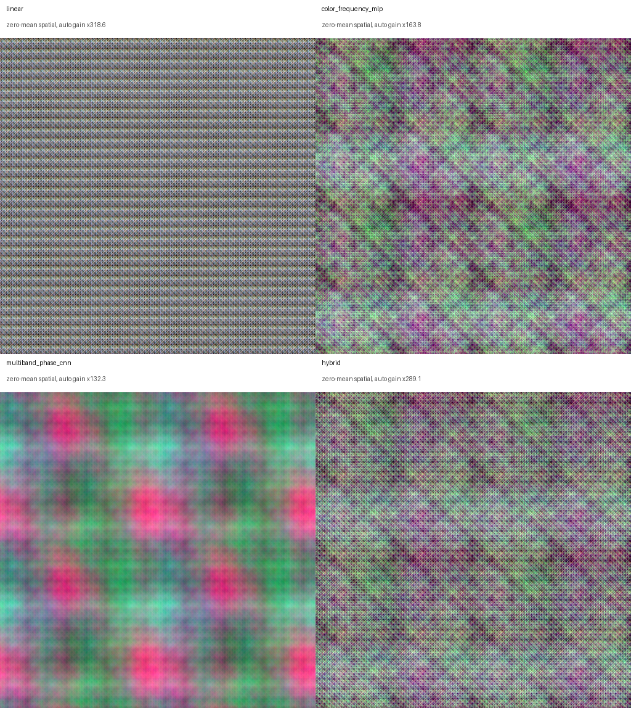
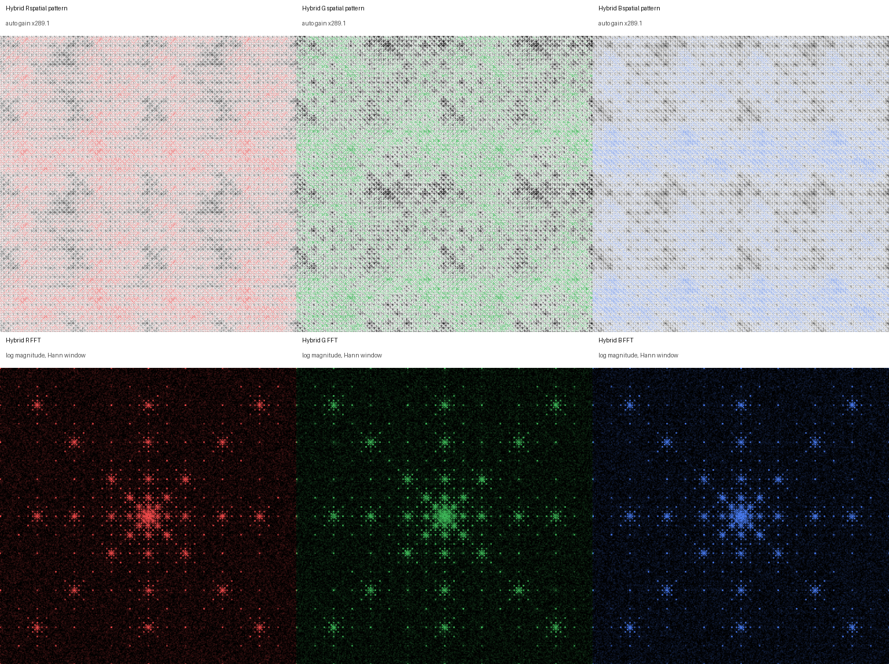

# Gemini Image Fidelity Correction

Gemini 이미지 편집을 `no-change` 프롬프트로 반복할 때 누적되는 미세한 RGB, 질감, 주파수 드리프트를 원본 없이 완화하는 실험적 보정 모델입니다. 추론 시에는 생성된 이미지 한 장만 사용합니다.

학습·평가 데이터는 Gemini 3.1 Flash Image API 모델인 `gemini-3.1-flash-image`에서 생성했으며, `1:1`과 `16:9` 비율의 `1K`·`2K` 네 가지 조합을 모두 포함합니다.

> Research prototype. This repository is an image-fidelity experiment, not a forensic detector or a guaranteed inverse of a generative model.

## 구조

- 색상 적응형 선형 RGB/DC 보정
- RGB, 밝기, 채도, 로컬 질감과 다중 주파수 특징을 사용하는 MLP
- 축/대각선 위상 채널과 팽창 합성곱을 사용하는 residual CNN
- 입력 이미지 특징만으로 세 보정 성분을 섞는 reference-free gate
- 하이라이트와 섀도 클리핑을 줄이는 channel soft-knee gamut mapping

주파수 특징은 `x`, `y`, `x+y`, `x-y` 방향의 sine/cosine 쌍과 2.67, 4, 8, 16, 32, 64, 128, 256픽셀 주기를 사용합니다. 단색/실사 라우팅은 없으며 모든 입력에 동일한 모델을 적용합니다.

## 설치

Python 3.11과 CUDA 환경을 권장합니다. 먼저 시스템 CUDA와 맞는 PyTorch를 설치한 뒤 나머지 의존성을 설치합니다.

```bash
pip install -r requirements.txt
```

## 실행

```bash
python src/apply_advanced_multiband_correction_model.py input.png output.png
```

다른 가중치 폴더를 지정하려면:

```bash
python src/apply_advanced_multiband_correction_model.py input.png output.png \
  --model-dir /path/to/models
```

출력 로그에는 장치, reference-free 선형 강도, hybrid 가중치, 채널별 평균 보정량과 gamut 제한 비율이 JSON으로 기록됩니다.

## 평가

MAE similarity는 `100 * (1 - mean(abs(candidate - reference)) / 255)`로 계산했습니다.

| 평가 | 샘플 | 평균 개선 | 개선/악화 | 최악값 |
|---|---:|---:|---:|---:|
| Grouped 5-fold OOF | 342 | +0.4637%p | 325 / 17 | -0.7590%p |
| External real-photo holdout | 10 | +0.3779%p | 9 / 1 | -0.0600%p |

평균적으로 개선되지만 모든 이미지에서 개선되는 모델은 아닙니다. 원본이 있는 평가 환경에서는 적용 전후 지표를 비교해야 합니다.

### 1024 실사 이미지 5회 회귀

`G1 = Gemini(source)`는 한 번만 생성하고, 정확히 같은 `G1`에서 다음 두 체인을 분기했습니다.

1. 무보정: `G1 -> G2 -> G3 -> G4 -> G5`
2. 매회 보정: `G1 -> C1 -> G2' -> C2 -> G3' -> C3 -> G4' -> C4 -> G5' -> C5`

여기서 `C1 = correction(G1)`, 이후 `Cn = correction(Gn')`이며, 매회 보정된 `Cn`을 다음 Gemini 호출의 입력으로 사용했습니다.

최종 MAE similarity는 무보정 체인 `96.4261%`, 매회 보정 체인 `98.2248%`로 `+1.7986%p` 높았습니다. 각 회차에서 보정 직전과 직후만 비교하면 5회 모두 양수였고 평균은 `+0.1244%p`였습니다. 두 체인의 단계별 차이에는 Gemini 샘플링과 입력 분기 효과도 포함되므로 보정 모델 하나의 인과 효과로만 해석하면 안 됩니다.


## 패턴 시각화

시각화 이미지는 표시를 위해 채널 DC를 제거하고 자동 gain을 적용한 결과입니다. 화면에 보이는 강도는 실제 보정량과 다릅니다.





## 파일

- `src/`: 추론 및 실험 코드
- `models/`: 릴리스 추론에 필요한 네 개 가중치
- `experiments/evaluation/`: grouped 5-fold와 외부 holdout 요약
- `experiments/recurrence_5x/`: 실사 1024 이미지 5회 회귀 비교
- `docs/`: component/FFT 패턴 시각화

## 제한사항

- 학습 분포 밖의 이미지에서는 보정이 악화될 수 있습니다.
- 강한 생성 변화, 기하 변화, 리프레이밍은 복원하지 못합니다.
- 반복 생성 실험은 Gemini 출력의 확률성 영향을 받습니다.
- CPU 추론은 가능하지만 1024 이상에서는 CUDA보다 크게 느립니다.
