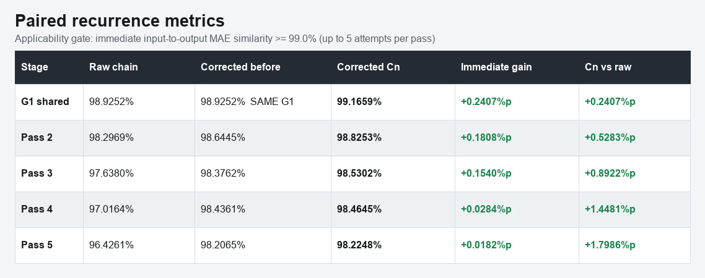
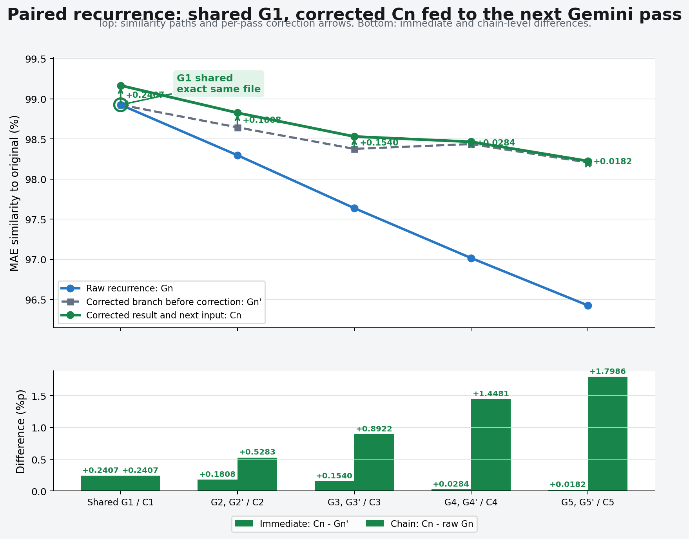
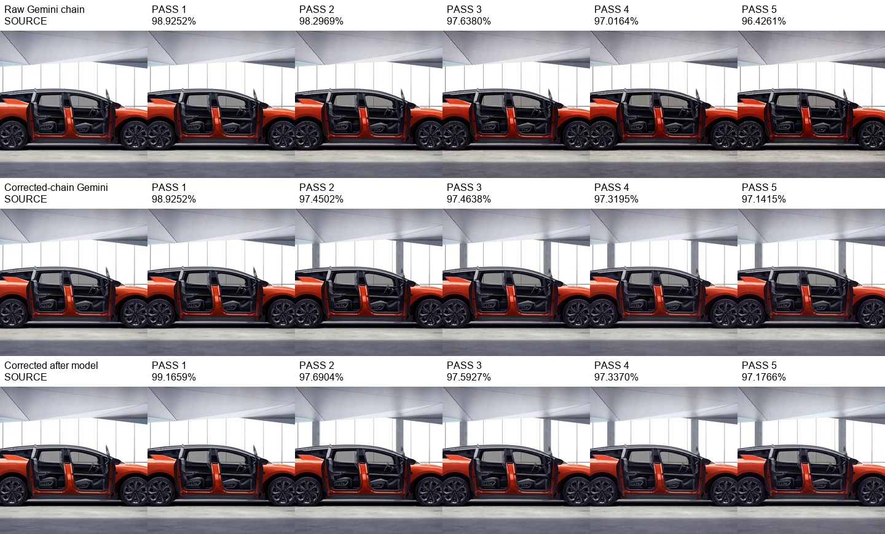
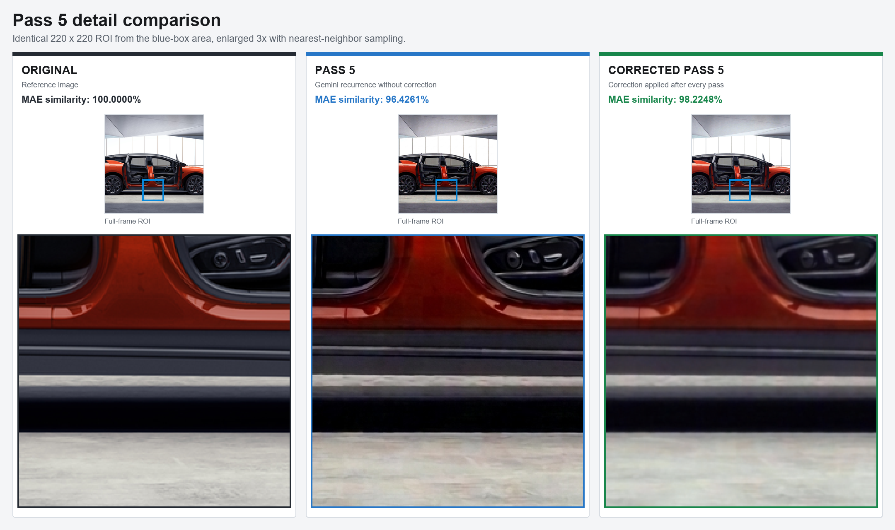

# 1024 real-photo recurrence comparison

## Protocol

- Input: one real automobile image, center-cropped without distortion to 1024x1024
- Gemini model: `gemini-3.1-flash-image`
- Request: 1K, 1:1, fixed no-change prompt
- Shared first pass: the exact same `G1` file is used by both chains
- Corrected recurrence: each corrected `Cn` becomes the input to the next Gemini pass
- Metric: MAE similarity to the original 1024 image

```text
G1 = Gemini(source)  # generated once

raw:       G1 -> G2 -> G3 -> G4 -> G5
corrected: G1 -> C1 -> G2' -> C2 -> G3' -> C3 -> G4' -> C4 -> G5' -> C5
```

| Stage | Raw chain | Corrected branch before | Corrected result | Immediate gain | Corrected vs raw | Next Gemini input |
|---|---:|---:|---:|---:|---:|---|
| Shared `G1` | `G1` 98.9252 | same `G1` 98.9252 | `C1` 99.1659 | +0.2407 | +0.2407 | `C1` |
| Pass 2 | `G2` 98.2969 | `G2'` 98.6445 | `C2` 98.8253 | +0.1808 | +0.5283 | `C2` |
| Pass 3 | `G3` 97.6380 | `G3'` 98.3762 | `C3` 98.5302 | +0.1540 | +0.8922 | `C3` |
| Pass 4 | `G4` 97.0164 | `G4'` 98.4361 | `C4` 98.4645 | +0.0284 | +1.4481 | `C4` |
| Pass 5 | `G5` 96.4261 | `G5'` 98.2065 | `C5` 98.2248 | +0.0182 | +1.7986 | final |









Full 1024×1024 comparison files: [original](pass5_comparison_1024/01_original_1024.png), [uncorrected Pass 5](pass5_comparison_1024/02_pass5_uncorrected_1024.png), and [corrected Pass 5](pass5_comparison_1024/03_pass5_corrected_1024.png).

The final corrected-chain similarity was `98.2248%`, compared with `96.4261%` for the raw chain, a difference of `+1.7986%p`. The mean immediate correction gain across five passes was `+0.1244%p`.

The correction improved the current image at every pass. The later chain-to-chain comparison also contains Gemini sampling variance because the corrected image changes the next request input.
